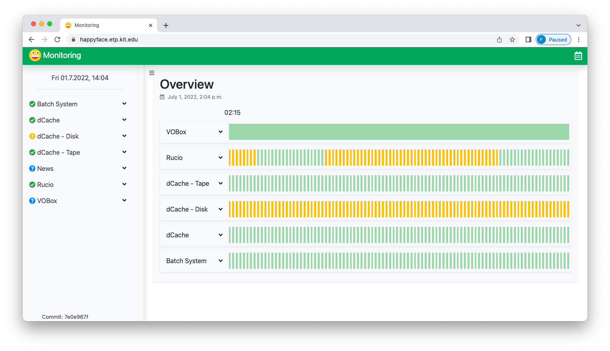
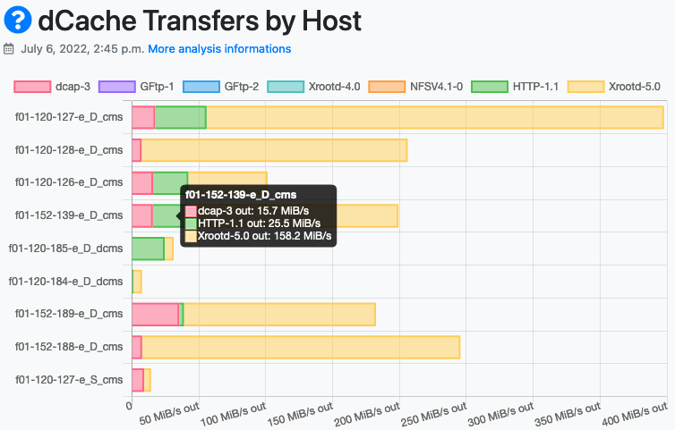
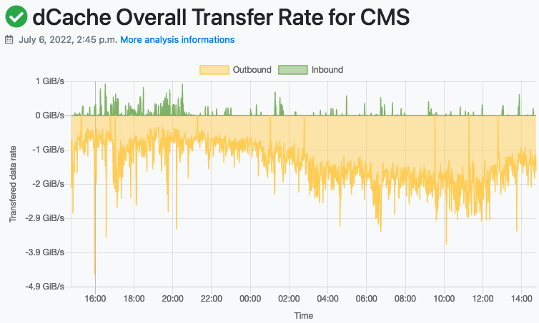

#  Happyface

A modern meta-monitoring tool that meets the requirements for monitoring the grid computing infrastructure and helps to collect the information in one place.
It's mobile friendly interface allows to see the status of multiple monitoring instances at a glance.

Built using the [django](https://www.djangoproject.com/) web framework and the [bootstrap](https://getbootstrap.com/) CSS framework.

## Features

### Overview page

Showing the status of the different monitoring instances and the categories.



### Interactive and versatile plots

Using the [chart.js](https://www.chartjs.org/) ploting tool.





## Deploy

HappyFace is deployed using `docker compose`. You can realtivlely easy start a local dev and test instance or deploy a production version on your server.

## Local Dev Setup

You can deploy a local dev version using shell scripts in the dev folder:

#### Build and Start Happyface Container

```bash
dev/start_dev.sh
```

#### Stop Happyface Container

```bash
dev/stop_dev.sh
```

#### Generate migrations

After a `models.py` files was changed new migration instructions need to be generated.

```bash
dev/makemigrations.sh
```

#### Show Logs

```bash
dev/logs_dev.sh
```

#### Open Debug Shell in Container

```bash
dev/debug_shell.sh
```

## Configs

You can configure HappyFace by specifing environment variables in the specifig `*.env` files.

- `website.env`: Happyface configs like hostnames, url to HF-Analyses repo etc.
- `db.env`: Postgres specific configs like db name and password.

